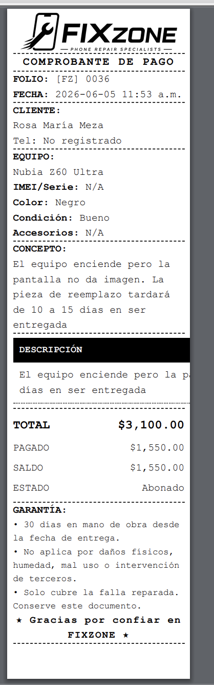
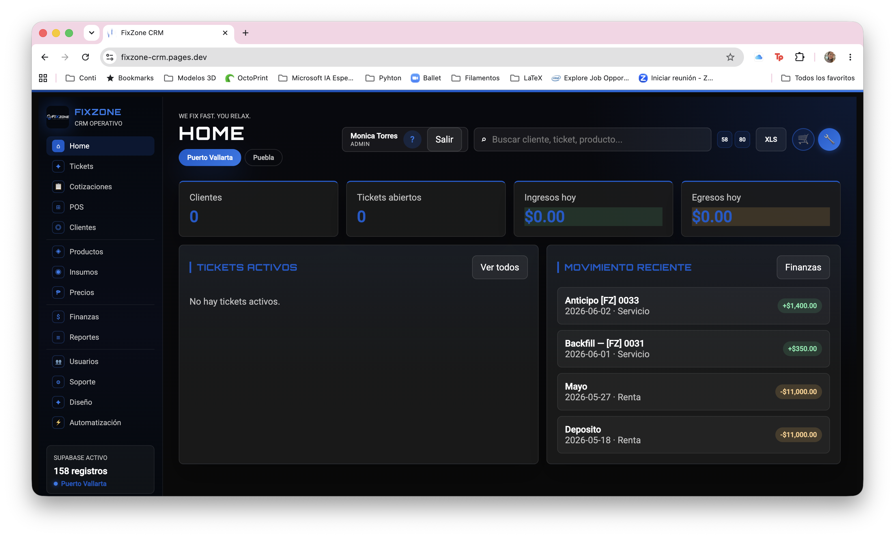
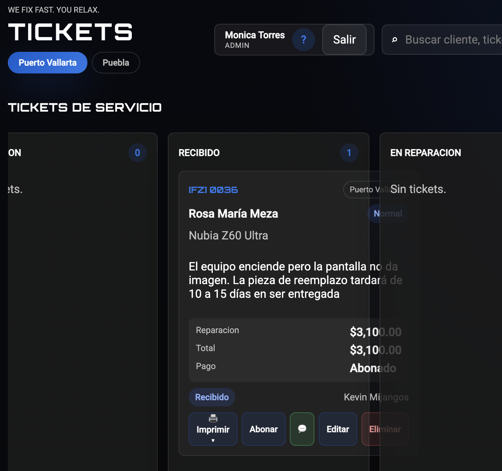

# FixZone CRM ToDo

_Última actualización: 2026-06-06_ (sesión 3)

## Fase 1: Definir operacion interna

- [x] Definir lista inicial de empleados que tendran acceso.
- [x] Definir roles internos: owner, admin, tecnico, ventas, viewer.
- [x] Registrar sucursales iniciales: Puerto Vallarta y Puebla.
- [x] Registrar empleados iniciales: Kevin Mijangos, Carlos Mijangos, Gigi Vargas, Monica Torres, Diego Mijangos y Daniel Mijangos.
- [x] Decidir si se usaran correos Gmail existentes o dominio propio mas adelante.
- [x] Definir flujo real de reparacion: Cotizacion, Recibido, En reparacion, Listo, Entregado, Garantia.
- [x] Definir datos obligatorios de cliente: nombre, telefono — cliente e IMEI opcionales en tickets walk-in.
- [x] Definir datos obligatorios de equipo: IMEI/serie, color, accesorios recibidos, estado fisico (campos en form de ticket, guardado en customer_devices).
- [x] Cambiar a RefaxZone los nombres de FixZone cuando la sucursal sea puebla

## Fase 2: Base de datos y seguridad

- [x] Crear proyecto en Supabase.
- [x] Registrar proyecto Supabase FixZone: `zwmffnrkrrowmchluyyy`.
- [x] Configurar Google OAuth en Supabase Auth.
- [x] Crear tabla `employees` con correo, rol y estado.
- [x] Crear schema SQL inicial para clientes, equipos, tickets, productos, inventario, compras, finanzas y adjuntos.
- [x] Activar Row Level Security en todas las tablas.
- [x] Crear politicas RLS para permitir acceso solo a empleados activos.
- [x] Crear permisos por rol.
- [x] Crear tabla `audit_log` para registrar acciones importantes.

## Fase 3: Migrar app actual a Supabase

- [x] Reemplazar `localStorage` por Supabase (modo remoto activo en producción).
- [x] Log in con usuario y contraseña. Usuarios internos de base de datos.
- [x] Bloquear la app si el correo no existe en `employees`.
- [x] Conectar clientes a la base de datos.
- [x] Conectar productos e inventario a la base de datos.
- [x] Conectar tickets a la base de datos.
- [x] Conectar compras de insumos a la base de datos.
- [x] Conectar ingresos y egresos a la base de datos.
- [x] Agregar estados de carga, errores y confirmaciones (toasts de éxito/error + confirm modal).

## Fase 4: Tickets y recibos

- [x] Mejorar folio de ticket con formato fijo `[FZ] 0001`.
- [x] Agregar impresion de recibo de recepcion, pago y garantia.
- [ ] Agregar plantilla con terminos y condiciones.
- [x] Permitir abonos, saldo pendiente y pagos parciales.
- [x] Pagos de tickets se registran automáticamente como Ingresos en Finanzas (backfill migration 20).
- [x] Agregar historial de eventos por ticket (detecta cambio de stage, timeline en modal de edición).
- [ ] Agregar fotos de evidencia antes y despues del dispositivo.
- [x] Modificar el tamaño del recibo — botones 58mm/80mm en el header, persiste en localStorage.
- [x] Impresión automática según estado del ticket (⚡ Auto en dropdown).
- [x] Clientes e IMEI opcionales en tickets walk-in — `supabase/19_nullable_customer_device.sql` aplicado.

## Fase 5: Inventario e insumos

- [x] Separar productos vendibles, refacciones e insumos internos (filtro en Productos + tipo guardado en DB).
- [x] Registrar entradas, salidas, ajustes y mermas (± Movimiento en sección Productos).
- [x] Descontar refacciones automaticamente cuando se usan en un ticket (al mover a Entregado).
- [x] Alertar stock bajo (banner en dashboard + tabla en reportes con cantidad faltante).
- [x] Importar inventario inicial Puerto Vallarta — `supabase/14_inventory_vallarta.sql` aplicado.
- [x] Compras de insumos vinculadas a producto del catálogo con incremento automático de stock — `supabase/15_supply_stock_link.sql`.
- [ ] Registrar proveedores (sección dedicada con nombre, contacto y RLS).
- [ ] Asociar compras de insumos con proveedor y comprobante — permitir adjuntar foto de comprobante.
- [ ] Exportar inventario a Excel.
- [x] Tabla de precios por dispositivo × servicio — costo de mano de obra, vista Precios con matriz editable, gestión de servicios, cotizador rápido con slider y −35% descuento base (migrations 21 + 21b + 22 aplicadas). Soporta variantes de precio por celda (ej. Original vs Genérica).
- [x] Precio base por servicio — `default_price` en service_types; Diagnóstico y Limpieza $350 fijos para todos los equipos (migration 22b).
- [x] Cotizador Precios → botón "Crear cotización" pre-llenado con precio calculado por fórmula de márgenes.
- [x] Traceabilidad bidireccional COT ↔ FZ — al aprobar cotización se asigna folio [FZ] nuevo, ambas cards muestran la referencia cruzada (migration 23).
- [ ] Reglas de margen sobre insumos — tabla configurable de rangos de costo con % de ganancia (ej. costo ≤ $1,500 → 110%, costo > $1,500 → 100%). Precio total = costo insumo + (costo × %ganancia) + mano de obra.
- [ ] Ticket de request de compra de insumos / material 

## Fase 6: Finanzas y reportes

- [x] Separar ingresos por servicios, ventas y anticipos.
- [x] Separar egresos por inventario, renta, nómina, etc.
- [x] Crear reporte de caja (hoy / 7 días / mes / todo con filtro de período).
- [x] Crear reporte mensual de ingresos y egresos (con desglose por categoría).
- [x] Crear reporte de tickets por estado (distribución con barra visual).
- [x] Crear reporte de empleados y productividad.
- [x] Crear reporte de utilidad estimada (ingresos − egresos por período, margen %, desglose por categoría).
- [x] Reporte de equipos más frecuentes — top 20 por sucursal con tickets, cerrados e ingresos (historial completo).
- [ ] Exportar reportes a Excel.
- [ ] Ver y descargar reportes de períodos anteriores o rangos personalizados.
- [ ] Considerar gastos de movilidad / gasolina como categoría de egreso (traslados a proveedor, entregas a domicilio).

## Fase 7: Marketing

- [x] Carpetas de assets de marca creadas: `assets/brand/fixzone/` y `assets/brand/refaxzone/`.
- [x] Plantillas de mensaje WhatsApp editables — tab Automatización (ahora incluye plantilla de Cotización).
- [x] Códigos de descuento en Supabase (`discount_codes`) — válidos en Cotización, Ticket y POS, con scope, fecha de vigencia, máx. usos, activo/inactivo, tipo fijo o porcentaje.
- [x] Marketing UI — cards compactas, links editables inline sin ticket a IT (add/edit/delete, con icono, nombre, URL y descripción).
- [ ] Integración WhatsApp Business Cloud API — envío automático al cliente cuando cambia el estado del ticket (Listo, Pagado, Garantía). Prerequisito: Meta Business verificado + número dedicado registrado en la API. Programación lista en 1 sprint una vez que estén los accesos.
- [ ] Función para enviar recordatorios de garantía o promociones por WhatsApp / email.
- [ ] Crear sección de plantillas de email para clientes, editable.
- [ ] Permitir subir/gestionar imágenes y documentos desde la UI.
- [x] Botón 📋 Copiar en cada plantilla de WhatsApp vinculada a tickets.
- [x] Repertorio de mensajes rápidos — saludo, horarios, tiempo de reparación, garantía, equipo listo, despedida, etc. Editable, con botón copiar en cada uno.

## Fase 8: Deploy interno

- [x] Elegir hosting: Cloudflare Pages (`fixzone-crm.pages.dev`).
- [x] Probar acceso desde celulares y computadoras del equipo.
- [x] Preparar versión privada para producción.
- [ ] Configurar respaldos automáticos de Supabase.
- [ ] Definir proceso formal para dar de alta y baja empleados.
- [ ] Configurar dominio propio (si se decide usar).

## Fase 9: Mejoras futuras

- [ ] Agregar notificaciones por WhatsApp o email automáticas (ticket listo, garantía por vencer).
- [ ] Agregar lector de códigos QR para consulta de tickets.
- [ ] Agregar integración contable si se requiere facturación formal.
- [ ] Actualizar logos en `assets/brand/` — los actuales son versiones antiguas.
- [x] Recibo de impresión de largo dinámico — alto del papel se ajusta al contenido real, sin espacio en blanco al final (`doPrint()` inyecta `@page { size: Xmm auto }` antes de cada impresión, evitando el bug de `var()` en `@page` de Chrome).
- [x] Autocomplete de equipo en tickets y cotizaciones — lista base ~100 modelos (iPhone/Samsung/Motorola/Xiaomi/Huawei), filtrado substring, opción agregar modelo nuevo.
- [x] Búsqueda avanzada por teléfono, IMEI, folio o cliente.
- [x] Filtrar dashboard por sucursal.
- [x] Editar datos de clientes.
- [x] Botón de perfil de usuario para cambiar contraseña.
- [x] Drag & drop en KANBANs (tickets + soporte IT).
- [x] Tooltips de sección al hacer hover en el nav.

## Fase 10: Fixes 

- [x] Finanzas: RLS y aparición en dashboard de nuevas transacciones.
- [x] Soporte IT: formulario, permisos y botón eliminar.
- [x] Tickets: RLS, fotos (Storage bucket), roles normalizados, campos opcionales.
- [x] Brand RefaxZone: paleta naranja correcta en todos los elementos y editor de marca.
- [x] Impresión: fuentes subidas, default 58mm, SUCURSAL removida, logo mono, auto-impresión por estado.
- [x] IMEI/color/accesorios se borran al editar — Fix: device record persiste con `customer_id` nullable.
- [x] Pagos de tickets crean transacción en Finanzas — backfill migration 20 aplicado.
- [x] dateStamp usa hora local (no UTC) — corrige "Ingresos hoy" después de las 7pm.
- [ ] Tickets — carga de fotos existe solo al editar, no al crear (diseño intencional por ahora).
- [ ] El logo de la entrada , de home, para iniciar sesion, es el equivocado. 
- [ ] No hay donde poner los datos de contacto del cliente en la creacion del ticket. 
- [ ]Que al tener datos de contacto de un cliente ese cliente se registre automaticamente 
- [ ] Poner que se peuda adjuntar fotos en los tickets para IT que crean los usuarios. 
- [ ] En el ticket, cuando el texto de la descripcióm es largo, se corta, no esta delimitado al ancho del ticket, mira: 

## Fase 11: Cotizaciones

- [x] Sección dedicada, cotización se convierte a ticket con un clic (Aprobar → Recibido).
- [x] Builder de partidas: + Servicio / + Producto, con qty, precio, tipo y eliminar fila; calcula total automáticamente.
- [x] Numeración `[COT] 0001` separada de `[FZ]` tickets.
- [x] Botón 💬 WhatsApp — genera mensaje con desglose de partidas y total (usa plantilla editable o mensaje automático).
- [x] Botón 🖨 Imprimir — PDF formal de cotización con tabla de partidas, subtotal, descuento, vigencia y firma.
- [x] Código de descuento aplicable desde el builder de cotización.
- [ ] Cambio de status de Cotización a "Venta concretada" (diferente de aprobar como reparación).
- [x] Partidas de cotización sincronizadas con service_types — tipo Servicio usa select del catálogo, auto-rellena precio desde service_prices (o default_price) al seleccionar equipo + servicio.
- [x] Campo "Costo insumo" en partidas Servicio — al ingresar el costo, calcPrecio() calcula el precio final automáticamente con la fórmula de márgenes (pantalla o glass según servicio).
- [x] Cotizador en Precios → botón "Crear cotización" pre-llenado con precio calculado.
- [x] Traceabilidad bidireccional: al aprobar, cotización guarda folio [FZ] y ticket guarda folio [COT] de origen. Ambas referencias visibles en las cards.
- [ ] Métricas de cotizaciones en Reportes: total por período, tasa de conversión, monto promedio, cuántas se pierden sin aprobar.

## Fase 12: Punto de Venta (POS)

- [x] Arquitectura POS separada de Ticket (sin IVA, cliente opcional, stock por trigger).
- [x] Catálogo filtrable, carrito con qty, descuento fijo o por código, método de pago.
- [x] Checkout: INSERT pos_sales → pos_sale_items → transaction Ingreso/Venta automático.
- [x] Historial de ventas recientes.
- [x] Recibo imprimible con folio, productos, total, método de pago y código de descuento si aplica.
- [x] Ligar venta POS a cliente del catálogo (opcional).
- [x] Campo de código de descuento con botón Aplicar — valida scope, fecha, usos.
- [x] Constraint `CHECK (stock >= 0)` en DB — `supabase/17_pos_stock_constraint.sql` aplicado.
- [ ] Reporte de ventas POS por período (separado del reporte general de Finanzas).

## Fase 13: UX / Navegación

- [x] Sidebar compacto 220px, nav items 34px, entra completo en 100% de zoom.
- [x] Navegación por grupos con divisores: Operaciones / Inventario / Finanzas / Admin.
- [x] Botones circulares Ticket y POS en el header para acceso rápido (iconos Lucide SVG).
- [x] Cards de marketing compactas (padding reducido, fuente más pequeña).
- [x] Toasts de éxito/error y confirm modal reemplazando alert/confirm nativos.
- [x] **Sprint 3 — Design polish:** tipografía Outfit (body) + Orbitron solo brand mark, H1/H2 sin uppercase, iconografía unificada con Lucide, ghost-card shadows removidos, status badges con tokens de marca, marcatextos en finanzas corregido, atajos de teclado (N/P/D//, Escape), validación inline de formularios, empty states con CTAs, success toast, focus rings, scrollbar custom, reduced-motion.
- [ ] Revisar y simplificar opciones de impresión de tickets — actualmente hay múltiples botones/modalidades que pueden confundir el proceso o generar impresiones redundantes. Definir flujo claro: qué imprime qué y cuándo.
- [ ] Centro de notificaciones — avisos en tiempo real para: ticket asignado, cambio de stage, respuesta en ticket IT. Tickets de Soporte IT con hilo de comentarios y seguimiento de estado visible para quien lo levantó.
- [ ] Definir que se hará cuando ya haya muchos tickets en las columnas del KANBAN , tal vez hacer las cards mas chicas o acortar lo que hay visible a menos que se abra y se desgloce lo demas, tipo Hubspot. 
- [ ]Al hacer click en un movimiento reciente en "Home" , desplegar la vista de ese movimiento, es decir abrir la pantallita que muestra la informacion de ese movieminto 
- [ ] Si le damos en refresh, que se haga refresh en la tab que se quedó? porque siempre se va a home 
- [ ] Tickets estan muy grandes para la columna del kanban  Tipografia demasiado grande 
- [ ] Revisar que sea excelente para la navegacion en version movil. porque con la letra y las multiples secciones no quiero que se sature. 

## Fase 14 - IT 
- [ ] Que en cada task de IT permita la comunciacion IT <> Usuario